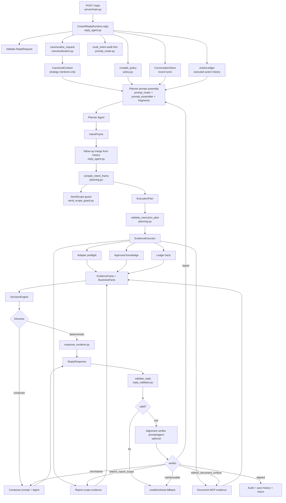
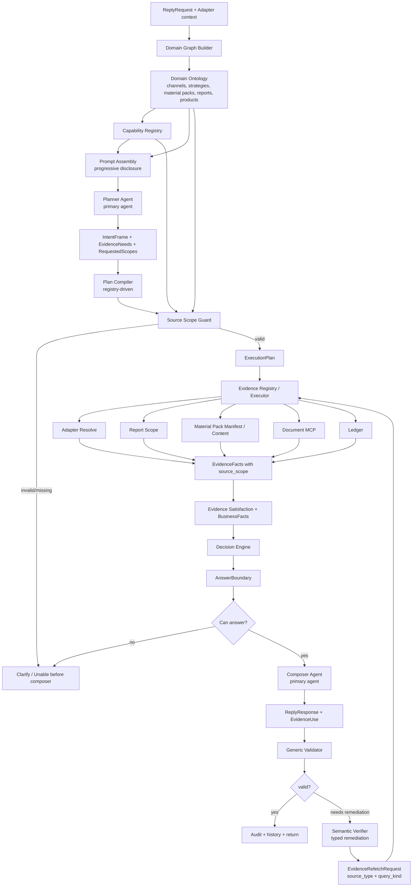

# Agent Architecture Audit

Date: 2026-06-16

Scope: planner, verifier, agent orchestration, canonicalization, SendScope guard, prompt assembly, evidence retrieval, history use, adapter channel ingestion, and related tests.

No production code was changed for this audit.

## Executive Summary

The current runtime already has useful seams: a public `/reply` endpoint, an orchestration runtime, typed `IntentFrame` and `ExecutionPlan` models, a static capability registry, deterministic evidence wrappers, postcondition guardrails, and an optional alignment verifier.

The main architectural gap is that source boundaries are not represented as first-class contracts. Capabilities describe actions and broad read capabilities, but they do not define the exact evidence source, source scope, answerable question types, or remediation behavior. As a result, the planner, decision engine, composer, guardrails, verifier, and prompt fragments each carry partial business logic. A new capability currently tends to require edits in all of those places.

The most important failure mode is visible in material-pack questions. The runtime can classify a question as `knowledge_answer`, see that some knowledge evidence exists, let the composer answer, and only later rely on validators or the alignment verifier to catch source drift. The agent should instead know before composition whether the current evidence contract can answer the user's question.

## Search Evidence

Broad ripgrep searches were run for architecture entry points, keyword matching, canonicalization, guards, prompts, source scope, and domain models. Important negative findings:

- No current domain graph or ontology module was found. Search for `DistributionChannel|DomainGraph|Ontology|class .*Strategy|class .*MaterialPack|class .*Channel|MaterialPack` under `src/market_support_crewai_agent` returned only `SendMaterialPackAction`, `StrategyMention`, and renderer references.
- No active callers were found for the legacy prompt template loader. Search for `PromptTemplateName|render_prompt_template|planner_intent.md|knowledge_composer.md|prompt_templates` returned only `src/market_support_crewai_agent/runtime/llm/prompt_templates.py`.

## Current Architecture



### Entry Point Map

| Area | Current entry point | Notes |
|---|---|---|
| Public route | `src/market_support_crewai_agent/server/main.py:58` | `POST /reply` validates auth/request and delegates to `build_reply`. |
| Runtime | `src/market_support_crewai_agent/runtime/orchestration/reply_agent.py:99` and `:160` | `build_reply` creates `CrewAIReplyRuntime`; `reply()` owns the full pipeline. |
| Planner | `src/market_support_crewai_agent/runtime/orchestration/reply_agent.py:275` | `_build_candidate_response` assembles the planner prompt and calls the planner agent. |
| Plan compiler | `src/market_support_crewai_agent/runtime/domain/planning.py:160` | `compile_intent_frame` turns planner intent into `ExecutionPlan`. |
| Plan validator | `src/market_support_crewai_agent/runtime/domain/planning.py:329` | `validate_execution_plan` validates modes, actions, policy, and evidence capability choices. |
| Verifier | `src/market_support_crewai_agent/runtime/orchestration/reply_agent.py:816` | `_verify_reply_alignment` calls custom verifier or prompt-based alignment verifier. |
| Verifier schema | `src/market_support_crewai_agent/runtime/validation/reply_alignment_verifier.py:14` | Failure/remediation enums are fixed and source-specific for document/report refetch. |
| Guardrails | `src/market_support_crewai_agent/runtime/validation/reply_validator.py:140` | `validate_reply` enforces policy, action/evidence alignment, locator leaks, and claim heuristics. |
| Canonicalization | `src/market_support_crewai_agent/runtime/domain/canonicalization.py:127` | `canonicalize_request` only canonicalizes strategy mentions and uses keyword/regex heuristics. |
| SendScope guard | `src/market_support_crewai_agent/runtime/validation/send_scope_guard.py:195` | Detects explicit send target conflicts using keyword/regex/token heuristics. |
| Prompt assembly | `src/market_support_crewai_agent/runtime/llm/prompt_router.py:57`, `prompt_assembler.py:26`, `prompt_fragments.py:24` | Router selects fragment ids; assembler renders fragments; registry stores markdown fragment definitions. |
| Prompt context | `src/market_support_crewai_agent/runtime/llm/prompt_context.py:71` | Renders request metadata, canonical context, policy, history, plan, evidence, business facts, and candidates. |
| Evidence executor | `src/market_support_crewai_agent/runtime/evidence/executor.py:47` | Runs adapter preflight, document MCP, report scope, approved knowledge, ledger facts, and business fact derivation. |
| Adapter preflight | `src/market_support_crewai_agent/runtime/evidence/adapter_preflight.py:67` | Builds adapter resolve requests from plan; currently ignores `canonical_context` at `:118`. |
| Report scope evidence | `src/market_support_crewai_agent/runtime/evidence/report_scope.py:89` | Uses adapter report-scope endpoint and a closed-set selector for report-scope questions. |
| Document evidence | `src/market_support_crewai_agent/runtime/evidence/document_mcp.py:178` | Fetches document context through MCP, with local block ranking. |
| Adapter channel ingestion | `src/market_support_crewai_agent/schemas.py:64` and `:102` | `ReplyRequest` and `AdapterResolveResult` carry flat channel/material/strategy/report metadata. |

## Planner / Verifier Coupling Points

| Coupling point | Current location | Why it couples planner and verifier | Refactor direction |
|---|---|---|---|
| Capability semantics live in prompts, compiler, verifier, and guardrails | `planning.py:160`, `reply_validator.py`, `alignment_verifier_base.md`, `prompt_fragments.py` | Adding a capability requires new planner instructions, compiler branches, evidence logic, validator logic, and verifier remediation behavior. | Capability registry should expose planning contract, evidence contract, answer contract, action contract, and remediation contract. |
| Verifier remediation enum is source-specific | `reply_alignment_verifier.py:30` | `refetch_document_context` and `refetch_report_scope` are baked into the verifier contract. A material-pack source would need bespoke schema and orchestrator changes. | Use typed `EvidenceRefetchRequest` with `source_type`, `query_kind`, and `capability`, dispatched through the evidence registry. |
| Remediation loop is hardcoded | `reply_agent.py:639`, `:668`, `:705`, `:741` | Replan, refetch report, refetch document, and recompose are separate branches. | Generic remediation dispatcher keyed by registry-owned remediation handlers. |
| Report refetch query is keyword normalized | `reply_agent.py:1094` | Verifier text like "products" is mapped to sentinel report queries by keyword. | Verifier emits enum query kinds such as `products`, `summary`, `match`; no text normalization. |
| Evidence sufficiency is broad | `decision.py:422` and `reply_validator.py` | Any document context, report scope, or report period evidence can satisfy a `knowledge_answer`; source scope is not tied to the user's question. | Source Scope Guard evaluates typed `EvidenceNeed` against typed `EvidenceFact.source_scope` before composer invocation. |
| Planner can request broad knowledge answers | `prompt_fragments/output/intent_frame_schema.md:34` | The prompt says `knowledge_answer` may use `document_context`, `weekly_report`, or `monthly_report`, but there is no material-pack content source and no capability-specific answer boundary. | Prompt cards should be generated from registry source contracts and only show currently available answerable sources. |

## Keyword-Matching Findings

Classification legend:

- Acceptable deterministic exact validation: text/enum checks that validate a contract, auth header, model family, locator leak, or prompt-injection pattern without making semantic business selections.
- Dangerous semantic keyword matching: keyword, substring, regex, n-gram, or token logic used to select intent, strategy, source scope, artifact, product, document, or report meaning.
- Prompt-scattered business logic: business rules expressed in prompt fragments instead of registry/schema.
- Test-only: tests that lock in or exercise keyword behavior.
- Unrelated: utility code not involved in semantic routing or business decisions.

| File | Line | Finding | Risk | Replacement |
|---|---:|---|---|---|
| `src/market_support_crewai_agent/runtime/domain/canonicalization.py` | 72 | Hardcoded alias/regex table for strategy names and strategy typos. | Dangerous semantic keyword matching | Replace with adapter/catalog-provided ontology aliases or a closed-set entity resolver over explicit `available_strategies`; return canonical strategy IDs and evidence spans. |
| `src/market_support_crewai_agent/runtime/domain/canonicalization.py` | 187 | Direct substring match: normalized strategy name inside normalized message. | Dangerous semantic keyword matching | Use exact canonical IDs from ontology; allow exact equality only on canonical structured fields, not free-text substring selection. |
| `src/market_support_crewai_agent/runtime/domain/canonicalization.py` | 197 | Alias regex matching and generic `指增` fallback. | Dangerous semantic keyword matching | Move aliases to ontology nodes with ambiguity metadata; require resolver confidence and ambiguity handling. |
| `src/market_support_crewai_agent/runtime/domain/canonicalization.py` | 223 | Alias target resolved by substring overlap against available strategy names. | Dangerous semantic keyword matching | Alias target should already point to canonical strategy IDs; do not infer by name overlap. |
| `src/market_support_crewai_agent/runtime/domain/canonicalization.py` | 267 | `_looks_like_index_enhancement_strategy` uses token list. | Dangerous semantic keyword matching | Represent strategy category, product family, and benchmark as ontology fields. |
| `src/market_support_crewai_agent/runtime/validation/send_scope_guard.py` | 15 | Artifact keyword table for material/weekly/monthly send target detection. | Dangerous semantic keyword matching | Planner or selector emits structured `RequestedScope` with target kind/name/span; guard compares canonical channel/strategy IDs. |
| `src/market_support_crewai_agent/runtime/validation/send_scope_guard.py` | 21 | Large leading/trailing/current/generic token tables for target extraction. | Dangerous semantic keyword matching | Use adapter channel resolver and domain graph aliases; no organization/channel inference by token stripping. |
| `src/market_support_crewai_agent/runtime/validation/send_scope_guard.py` | 220 | `explicit_send_targets` finds artifact keywords by regex and extracts nearby text. | Dangerous semantic keyword matching | Replace with typed scope parser/closed-set selector over current channel, known channels, and explicit candidates from adapter. |
| `src/market_support_crewai_agent/runtime/validation/send_scope_guard.py` | 327 | `_target_references_current_scope` and `_names_overlap` use substring/name overlap. | Dangerous semantic keyword matching | Compare `RequestedScope.target_id` to current `DistributionChannel.id` or `Strategy.id`; aliases only from ontology. |
| `src/market_support_crewai_agent/runtime/domain/planning.py` | 790 | `_message_requests_unnamed_strategy_report` detects report/strategy intent through token lists. | Dangerous semantic keyword matching | Planner emits structured `scope_reference` and `strategy_slot_state`; compiler validates against ontology. |
| `src/market_support_crewai_agent/runtime/orchestration/reply_agent.py` | 1094 | `_report_scope_refetch_query` maps verifier text to `report_scope_products` / `report_scope_summary` by keyword. | Dangerous semantic keyword matching | Verifier emits typed `EvidenceRefetchRequest.query_kind`. |
| `src/market_support_crewai_agent/runtime/validation/reply_validator.py` | 606 | Sent-claim grounding scans reply text for send/report/material tokens. | Dangerous semantic keyword matching, medium | Add typed `ReplyEvidenceUse` / `ReplyClaims`; keep text scan only as defense-in-depth. |
| `src/market_support_crewai_agent/runtime/validation/reply_validator.py` | 631 | Report claim validator detects report labels/templates in reply text. | Dangerous semantic keyword matching, medium | Validate composer-declared source-backed claims against evidence facts and source scopes. |
| `src/market_support_crewai_agent/runtime/evidence/document_mcp.py` | 671 | Document block selection uses semantic terms, n-grams, and strategy substring scoring. | Dangerous semantic keyword matching | Prefer MCP-returned bounded chunks or closed-set chunk/section selector with chunk IDs and source metadata. |
| `src/market_support_crewai_agent/runtime/llm/prompt_router.py` | 115 | `_named_strategy_count` uses strategy substring in visible text. | Dangerous but low operational impact | Remove from audit hint or derive from `CanonicalContext` only. `route_intent` is documented non-authoritative. |
| `src/market_support_crewai_agent/runtime/llm/prompt_router.py` | 22 | Model-family routing uses substring in model name. | Acceptable deterministic exact validation | Optional cleanup: move to model registry metadata. |
| `src/market_support_crewai_agent/schemas.py` | 408 | Raw locator text validator rejects raw upload/reference fields in customer text. | Acceptable deterministic exact validation | Keep. This validates a response contract rather than selecting semantic meaning. |
| `src/market_support_crewai_agent/server/main.py` | 48 | Auth header parsing checks `Bearer `. | Acceptable deterministic exact validation | Keep. |
| `src/market_support_crewai_agent/runtime/evidence/document_mcp.py` | 24 | Prompt-injection pattern regexes. | Acceptable deterministic exact validation | Keep as safety sanitizer. |
| `src/market_support_crewai_agent/runtime/evidence/report_scope.py` | 467 | Closed-set report selector prompt says not to use keyword scoring. | Acceptable schema-based selector | Use as a pattern for ontology/entity/source selectors. |
| `src/market_support_crewai_agent/runtime/knowledge/approved_knowledge.py` | 363 | Closed-set approved-knowledge selector prompt says not to use keyword matching. | Acceptable schema-based selector | Use as a pattern for capability-bound selectors. |
| `src/market_support_crewai_agent/runtime/llm/fragments/planner/intent_taxonomy.md` | 5 | Artifact/action matrix and disambiguation rules are prompt text. | Prompt-scattered business logic | Generate capability prompt cards from registry; keep only general reasoning instructions in static prompts. |
| `src/market_support_crewai_agent/runtime/llm/fragments/capability/material_pack.md` | 7 | Material/product wording rules live in optional prompt fragment. | Prompt-scattered business logic | Move material-pack answerability and content elements to material-pack evidence contract. |
| `src/market_support_crewai_agent/runtime/llm/fragments/capability/weekly_report.md` | 5 | Weekly performance-data rule lives in prompt. | Prompt-scattered business logic | Generate from weekly-report capability source contract. |
| `src/market_support_crewai_agent/runtime/llm/fragments/capability/monthly_report.md` | 5 | Monthly report send wording lives in prompt. | Prompt-scattered business logic | Generate from monthly-report capability source contract. |
| `src/market_support_crewai_agent/runtime/llm/fragments/examples/knowledge_answer.md` | 6 | Example maps product question after weekly send to weekly report products. | Prompt-scattered business logic | Replace with source-scoped examples generated only when the relevant evidence source is available. |
| `tests/test_canonicalization.py` | 26 | Tests assert numeric aliases, generic `指增`, typo, and substring behavior. | Test-only, locks dangerous behavior | Replace with ontology/entity resolver tests that assert ambiguity, exact IDs, and no substring fallback. |
| `tests/test_reply_contract.py` | 760 | Test covers SendScope keyword conflict behavior. | Test-only, locks current guard | Replace with structured `RequestedScope`/ontology tests while preserving behavior. |
| `tests/test_structured_guardrails.py` | 484 | Tests allow report-scope/report-period evidence for generic `knowledge_answer`. | Test-only, reveals missing source-scope check | Split by answer source: weekly report products, report period, material-pack content, document context. |

## Prompt Scattering Map

| Location | Current role | Scattered business logic |
|---|---|---|
| `src/market_support_crewai_agent/runtime/orchestration/reply_agent.py:970` | Agent roles/backstories for planner, composer, verifier. | Agent capability boundary is described in role text, not fully in contracts. |
| `src/market_support_crewai_agent/runtime/llm/prompt_fragments.py:24` | Registry of markdown fragments. | Registry is central, but selected fragments contain business/domain rules manually. |
| `src/market_support_crewai_agent/runtime/llm/prompt_router.py:57` | Chooses fragments per prompt stage/model family. | Fragment selection is hardcoded; capability cards are mostly not selected by default. |
| `src/market_support_crewai_agent/runtime/llm/prompt_assembler.py:26` | Renders selected fragment programs. | Assembly is reusable, but it does not yet generate capability/source cards from registry contracts. |
| `src/market_support_crewai_agent/runtime/llm/prompt_context.py:71` | Builds prompt context from request, policy, history, plan, evidence, facts, validation, and candidates. | Context includes broad evidence facts but no compact answerability matrix such as "question X can only be answered by source Y". |
| `src/market_support_crewai_agent/runtime/llm/fragments/planner/intent_taxonomy.md:1` | Planner taxonomy. | Artifact/action/source distinctions are encoded as instructions. |
| `src/market_support_crewai_agent/runtime/llm/fragments/output/intent_frame_schema.md:1` | Planner output schema guidance. | Knowledge-source choices are listed without source-scope satisfaction rules. |
| `src/market_support_crewai_agent/runtime/llm/fragments/base/knowledge_composer_base.md:1` | Composer rules. | Composer is told not to use unsupported sources, but the runtime should withhold composer execution until source satisfaction is proven. |
| `src/market_support_crewai_agent/runtime/llm/fragments/base/alignment_verifier_base.md:1` | Verifier rules and remediation options. | Verifier must know source-specific remediation names. |
| `src/market_support_crewai_agent/runtime/llm/fragments/base/smalltalk_composer_base.md:1` | Smalltalk policy. | Fixed replies and identity/gender policy are prompt-only. |
| `src/market_support_crewai_agent/runtime/llm/prompts/*.md` | Legacy prompt files. | Active callers not found; `prompt_templates.py` appears unused. |

## Domain Hierarchy Gaps

Required hierarchy:

```text
Distribution channel comes from adapter.
Distribution channel is bank or non-bank.
Bank channel may have multiple strategies.
Non-bank channel usually has one strategy, but future multiple strategies must be allowed.
Material pack is strategy-related and may contain product info, open calendar, and other artifacts.
Weekly/monthly reports contain product performance under a channel and may be strategy-related in some scenarios.
Weekly/monthly reports are not equivalent to material packs.
```

Current gaps:

| Gap | Current evidence | Impact |
|---|---|---|
| No explicit `DistributionChannel` domain node or ID. | `ReplyRequest` carries `dist_channel_name` and `channel_type` at `schemas.py:64`; no domain graph search hit. | Send scope and source scope compare names instead of canonical IDs. |
| Strategies are flat strings. | `available_strategies: list[str]` in `schemas.py:72`; `StrategyMention` in `planning.py:69` stores text/source/confidence. | Bank/non-bank strategy cardinality, aliases, categories, and material-pack relationships are not explicit. |
| Material pack is an action artifact, not a content evidence source. | `EvidenceFactType` has `material_pack_resolvable`, but no material-pack content/manifest fact in `evidence/models.py:13`. | The agent cannot answer "what product is in the material pack" from a material-pack boundary. |
| Report scope is richer than material pack. | `AdapterReportScopeResult` and report facts exist in `schemas.py:160` and `evidence/models.py`; no parallel material-pack manifest/content contract exists. | Report evidence can accidentally become the only available source for product questions. |
| Weekly/monthly report and material pack source boundaries are not encoded. | `decision.py:422` and `reply_validator.py` allow broad knowledge evidence satisfaction. | A report source may satisfy a material-pack question unless the verifier catches it. |
| Non-bank future multi-strategy is not modeled. | Current logic often treats strategy count as text/defaulting logic, not graph cardinality. | Adding multiple strategies for non-bank channels risks special-case prompt/compiler changes. |

## Refactor Map

### Capability Registry

Current nucleus: `src/market_support_crewai_agent/runtime/domain/capabilities.py`.

Keep this as the central capability registry and expand `CapabilitySpec` beyond names/actions. It should own:

- capability name and artifact kind
- supported response modes
- send actions and adapter resolve types
- evidence source contract
- answerable question kinds
- required domain graph slots
- allowed source scopes
- validator hooks or generic validation requirements
- remediation handlers
- generated planner/composer/verifier prompt views

Files that should consume the registry instead of duplicating capability logic:

- `runtime/domain/planning.py`
- `runtime/domain/policy.py`
- `runtime/evidence/executor.py`
- `runtime/orchestration/decision.py`
- `runtime/validation/reply_validator.py`
- `runtime/validation/reply_alignment_verifier.py`
- `runtime/llm/prompt_router.py`
- `runtime/llm/prompt_fragments.py`

### Domain Ontology / Domain Graph

Current module: not found.

Proposed ownership: add a new domain module under `src/market_support_crewai_agent/runtime/domain/` for the graph. Do not overload `canonicalization.py`; canonicalization should become a resolver over graph nodes, not the graph itself.

Graph nodes:

- `DistributionChannel`
- `Strategy`
- `MaterialPack`
- `ReportArtifact`
- `Product`
- `ReportPeriod`

Graph edges:

- channel has type: bank or non-bank
- channel has strategies
- strategy belongs to channel
- strategy has material pack
- material pack contains content sections such as products and open calendar
- channel has weekly/monthly reports
- report may cover channel-wide products and may optionally cover strategies

Initial graph sources:

- `ReplyRequest.dist_channel_name`
- `ReplyRequest.channel_type`
- `ReplyRequest.available_strategies`
- `ReplyRequest.available_materials`
- `AdapterResolveResult.channel_type`
- `AdapterResolveResult.available_materials`
- `AdapterResolveResult.available_strategies`
- `AdapterResolveResult.strategy`
- report metadata and report scope results

### Evidence Contract / Source Scope Guard

Current nuclei:

- `src/market_support_crewai_agent/runtime/evidence/models.py`
- `src/market_support_crewai_agent/runtime/evidence/executor.py`
- `src/market_support_crewai_agent/runtime/evidence/adapter_preflight.py`
- `src/market_support_crewai_agent/runtime/evidence/report_scope.py`
- `src/market_support_crewai_agent/runtime/evidence/document_mcp.py`
- `src/market_support_crewai_agent/runtime/orchestration/decision.py`
- `src/market_support_crewai_agent/runtime/validation/reply_validator.py`

Add first-class concepts:

- `EvidenceNeed`: capability, source type, query kind, target domain node, required fields.
- `EvidenceFact.source_scope`: channel id, strategy id, artifact kind, period, section, product ids where known.
- `EvidenceSatisfaction`: whether each need is satisfied, missing, ambiguous, unavailable, or forbidden.
- `AnswerBoundary`: compact matrix passed to planner/composer: what can be answered, from which source, and what must abstain.

Source Scope Guard behavior:

- Runs before composer.
- Blocks composition when a question asks for material-pack content but material-pack content evidence is absent.
- Blocks report evidence from satisfying material-pack questions unless the evidence contract explicitly allows that source substitution.
- Blocks history-only answer synthesis unless the relevant source evidence or ledger fact is present.

### Prompt Registry / Prompt Assembly Layers

Current nuclei:

- `runtime/llm/prompt_fragments.py`
- `runtime/llm/prompt_router.py`
- `runtime/llm/prompt_assembler.py`
- `runtime/llm/prompt_context.py`

Target layers:

1. Static base prompts: role, output discipline, safety, concise reply style.
2. Registry-generated capability cards: one compact card per relevant capability.
3. Registry-generated evidence cards: source contracts and answer boundaries for available evidence.
4. Domain graph context: channel type, strategies, material/report relationships.
5. Runtime context: recent turns, ledger summary, current request, plan/evidence/validation state.
6. Examples: selected only by capability/source, not globally.

Move business rules out of these prompt fragments first:

- `fragments/planner/intent_taxonomy.md`
- `fragments/capability/material_pack.md`
- `fragments/capability/weekly_report.md`
- `fragments/capability/monthly_report.md`
- `fragments/channel/bank_material_rules.md`
- `fragments/examples/knowledge_answer.md`
- `fragments/examples/report_scope.md`

## Proposed Architecture



Architectural inspiration applied:

- OpenCode: planner/composer are primary agents; selectors and evidence fetchers are bounded subagents/workers with permission isolation.
- Oh My OpenAgent: planning, execution, and worker layers are separated; model/capability routing comes from registries.
- Hermes: core contracts are platform-agnostic; tools, prompts, capabilities, and evidence sources are registry-driven with progressive disclosure.

## Replacement Priority

1. Add `EvidenceNeed`, `EvidenceSatisfaction`, and pre-composer Source Scope Guard.
2. Add material-pack content/manifest evidence contract, even if the initial implementation only returns unavailable when adapter evidence is absent.
3. Replace broad `knowledge_answer` evidence checks in `decision.py` and `reply_validator.py`.
4. Replace SendScope keyword guard with structured `RequestedScope` and ontology ID comparison.
5. Replace strategy canonicalization keyword/regex logic with graph-backed closed-set entity resolution.
6. Replace verifier text refetch query normalization with typed refetch requests.
7. Move prompt-scattered capability rules into registry-generated prompt cards.
8. Convert text-claim validators to typed `EvidenceUse` / claim validation, keeping text scans as defense-in-depth.

## PR-Sized Implementation Plan

### PR 1: Capability Registry Expansion

- Expand the existing `CapabilitySpec` in `runtime/domain/capabilities.py`.
- Add evidence contract fields, answerable question kinds, required context slots, and prompt-view generation data.
- Keep existing behavior unchanged.
- Add snapshot-style tests proving all current capabilities have registry entries.

### PR 2: Domain Graph Skeleton

- Add a domain graph builder fed by `ReplyRequest` and adapter resolve results.
- Represent channel type, strategies, material availability, report artifacts, and source relationships.
- Do not remove old canonicalization yet.
- Add tests for bank multi-strategy and non-bank multi-strategy readiness.

### PR 3: EvidenceNeed and Source Scope Guard

- Add typed `EvidenceNeed` and `EvidenceSatisfaction`.
- Have the plan compiler produce evidence needs for `knowledge_answer` and mixed answer+send plans.
- Gate composer invocation on satisfied evidence needs.
- Add regression test for "what is the product in the material pack" with no material-pack evidence returning unable before composer.

### PR 4: Material-Pack Evidence Contract

- Add material-pack source facts for manifest/content availability.
- Initially support adapter resolve/preflight availability and explicit unavailable states.
- If adapter support exists later, add bounded material-pack content fetch.
- Add tests proving weekly/monthly report evidence cannot satisfy material-pack content questions.

### PR 5: Structured SendScope

- Replace `send_scope_guard.py` keyword extraction with planner/selector-emitted `RequestedScope`.
- Validate requested scope against domain graph channel/strategy IDs.
- Preserve current cross-channel conflict behavior with structured tests.

### PR 6: Graph-Backed Canonicalization

- Replace strategy alias/regex matching with ontology-backed closed-set resolution.
- Remove direct substring fallback for strategy names.
- Convert `tests/test_canonicalization.py` from keyword behavior to resolver behavior.

### PR 7: Prompt Registry Layering

- Generate capability and evidence prompt cards from the capability registry and domain graph.
- Keep static base prompts, but remove duplicated artifact/source rules from routine fragments.
- Confirm legacy `prompt_templates.py` has no active callers; remove or mark deprecated in a separate cleanup.

### PR 8: Generic Verifier Remediation

- Replace source-specific remediation enum fields with typed `EvidenceRefetchRequest`.
- Dispatch verifier remediation through the evidence registry.
- Remove `_report_scope_refetch_query` keyword mapping.

### PR 9: Typed Claims and EvidenceUse

- Extend composer output or adjacent internal schema with typed `EvidenceUse` / claim references.
- Validate claims against evidence facts and source scope.
- Keep text scans for locator/sent-claim safety as secondary guardrails.

## Test Plan

Add or update these named tests:

| Test case | Purpose |
|---|---|
| `test_capability_registry_exposes_evidence_contracts_for_all_capabilities` | Every capability declares action, evidence, answer, validation, and prompt contracts. |
| `test_plan_compiler_uses_registry_without_capability_specific_branches` | New capability metadata can be consumed without adding verifier/compiler special cases. |
| `test_domain_ontology_preserves_bank_channel_multi_strategy_material_rule` | Bank channel can have multiple strategies and material pack remains strategy-related. |
| `test_domain_ontology_allows_non_bank_multiple_strategies_without_code_change` | Future non-bank multi-strategy support is represented in graph cardinality. |
| `test_canonical_entity_resolver_does_not_use_substring_strategy_selection` | Strategy resolution does not select by free-text substring. |
| `test_send_scope_guard_uses_requested_scope_ids_not_message_keywords` | Cross-channel send guard compares canonical IDs. |
| `test_material_pack_content_question_without_material_evidence_returns_unable` | Agent abstains before composer when material-pack content source is absent. |
| `test_material_pack_content_question_does_not_use_weekly_report_products` | Weekly report products cannot answer material-pack content questions. |
| `test_weekly_report_products_question_requires_weekly_report_scope_evidence` | Weekly report product answers require report-scope product evidence. |
| `test_report_period_answer_uses_report_period_evidence_only` | Report period answer is satisfied by report-period evidence and not unrelated context. |
| `test_source_scope_guard_blocks_cross_source_evidence_substitution` | Material, weekly, monthly, and document sources are not interchangeable unless explicitly allowed. |
| `test_composer_not_invoked_when_evidence_need_unsatisfied` | Runtime refuses/clarifies before LLM composition when answer boundary is missing. |
| `test_verifier_typed_refetch_request_dispatches_by_evidence_source` | Verifier remediation routes by typed source/query kind. |
| `test_prompt_program_includes_only_relevant_capability_cards` | Progressive disclosure only includes cards relevant to request/policy/evidence. |
| `test_prompt_registry_renders_from_capability_registry_snapshot` | Prompt capability cards are generated from registry metadata. |
| `test_legacy_prompt_templates_have_no_active_callers_or_are_removed` | Confirms the old prompt template path stays unused or is deleted. |
| `test_audit_records_evidence_needs_source_scope_and_satisfaction` | Audit trace captures why an answer was allowed or blocked. |
| `test_claim_validator_rejects_unsourced_product_list_claim` | Product list claims require typed source evidence. |

## Existing Test Coverage Map

| File | Relevant coverage |
|---|---|
| `tests/test_reply_contract.py` | Runtime contract, send actions, mixed answer/action flows, verifier remediation, follow-up plans, SendScope conflict behavior. |
| `tests/test_planning_guardrails.py` | Planner compilation, SendScope compile guard, report-scope/report-period knowledge-answer planning. |
| `tests/test_structured_guardrails.py` | Reply validation, action grounding, sent-claim grounding, broad knowledge evidence acceptance. |
| `tests/test_report_scope_evidence.py` | Report scope evidence commands, period answers, product sentinels, mixed action/answer capability handling. |
| `tests/test_document_mcp.py` | Document evidence fetching, unavailable cases, local document block selection. |
| `tests/test_approved_knowledge.py` | Closed-set approved-knowledge selector behavior. |
| `tests/test_prompt_router.py` | Non-authoritative intent routing and prompt selection behavior. |
| `tests/test_prompt_assembler.py` | Fragment assembly, prompt context rendering, and default fragment inclusion/exclusion. |
| `tests/test_canonicalization.py` | Current strategy alias/regex/substring behavior; should be rewritten after ontology resolver lands. |
| `tests/test_alignment_verifier.py` | Alignment verifier schema shape and remediation requirements. |

## Current Failure Mode: Material-Pack Content Question

Observed design path:

1. User asks what product is in the `材料包`.
2. No material-pack harness/artifact/content evidence is available.
3. Planner may produce `knowledge_answer`.
4. Report/document/history evidence may still exist.
5. `DecisionEngine._has_knowledge_answer_evidence` and guardrails currently treat several evidence families as enough for generic `knowledge_answer`.
6. Composer can answer from the wrong source unless later validation or verifier catches it.

Target path:

1. Planner emits `EvidenceNeed(capability=material_pack, source_type=material_pack_content, query_kind=products)`.
2. Source Scope Guard checks material-pack content facts.
3. If no material-pack content evidence exists, composer is not invoked.
4. Runtime returns a concise unable/clarification response explaining that the current material pack content was not provided.
5. Verifier becomes a secondary semantic audit, not the first place source drift is discovered.

## Contract and Validator Impact

Public `/reply` should remain stable through the first phases. The internal contract should change first:

- `IntentFrame` and `ExecutionPlan` gain typed evidence needs and requested scopes.
- `EvidenceFact` gains source-scope metadata.
- Decision and validation consume `EvidenceSatisfaction`, not broad evidence existence.
- Composer prompt context receives an answer boundary matrix.

Validator impact:

- `validate_reply` should move from broad "some knowledge evidence exists" checks to source-scoped evidence-use validation.
- Text keyword claim scans remain useful as defense-in-depth but should not be the primary semantic validator.
- Alignment verifier should become generic over evidence contracts and typed remediation.

## Remaining Decisions

- Whether the adapter can provide canonical channel IDs, strategy IDs, material-pack manifests, and aliases. Without this, the ontology can still model local nodes, but source-scope guarantees remain name-based at the boundary.
- Whether material-pack content should be fetched through a new adapter resolve command, a document MCP command, or a dedicated material-pack evidence wrapper.
- Whether composer output should expose typed `EvidenceUse` inside public `ReplyResponse` or remain internal only. Internal-only is safer for preserving the public contract.
- Whether to deprecate `prompt_templates.py` immediately or keep it until prompt registry layering is complete.
