# 当前 Agent Vibe 报告

生成日期：2026-07-02

这份报告讲的是当前仓库里的真实实现，不是理想设计稿。它覆盖 `POST /reply` 从收到 WeCom adapter 请求，到 LLM 规划、证据执行、业务事实派生、回复/动作生成、校验、审计、保存历史的完整链路。

一句话概括：这个项目不是“让 CrewAI 自由发挥的多智能体”，而是一个 **Support Reply Harness**。LLM 只负责理解中文语义、提出结构化计划、在证据足够时组织简短回复；真正的权限、证据、发送资格、事实状态、动作合法性、审计都由 deterministic Python harness 控制。

## 1. 整体 Vibe

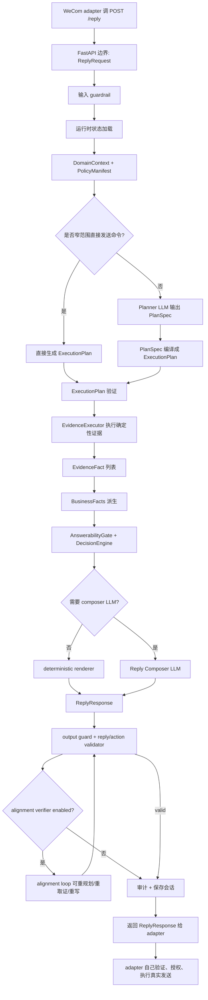

### 关键气质

- **LLM 是提案者，不是执行者**：planner 只交 `PlanSpec`，composer 只交 `ComposerReplyOutput`/`ReplyResponse`，不能直接调用 adapter。
- **adapter 是事实和执行边界**：能不能发、发什么、销售 mention 对象、报告周期，优先来自 adapter resolve/preflight。
- **state 是一串 typed 派生物**：`ReplyRequest -> DomainContext/PolicyManifest -> ExecutionPlan -> EvidenceFact -> BusinessFacts -> ResponseDirective -> ReplyResponse`。
- **动作只是 proposal**：`send_weekly_report` 这种 action 带 `resolve_ref` 回 adapter，adapter 最终验证并执行。
- **证据优先级很强**：计划、历史、LLM 解释都不能压过 adapter/evidence fact。

## 2. Public Contract：外部只看这层

入口在 `src/market_support_crewai_agent/server/main.py`。

```python
@app.post("/reply", response_model=ReplyResponse)
async def reply(request: ReplyRequest, _authorized: None = Depends(require_api_key)):
    validate_reply_request_input(request, get_settings())
    return await build_reply(request)
```

核心 DTO 在 `src/market_support_crewai_agent/schemas.py`：

```python
class ReplyRequest(StrictModel):
    conversation_key: str
    group_id: str
    sender_id: str
    message: str
    is_group: bool
    context_id: str | None
    group_name: str
    dist_channel_name: str
    sender_nickname: str
    available_artifacts: list[AvailableArtifact]
    channel_type: ChannelType
    allowed_read_capabilities: list[ReadCapability]

class ReplyResponse(StrictModel):
    contract_version: Literal["reply"] = "reply"
    response_id: str = ""
    reply: PrimaryReply
    actions: list[OutboundAction] = []
```

对 adapter 来说，agent 返回的东西只有两类：

```text
reply.text      用户可见文字
reply.mentions  用户可见销售 mention 语义
actions         adapter 可验证/授权/执行的 outbound action proposal
```

当前公开 outbound action 只有：

```text
send_material_pack
send_weekly_report
send_monthly_report
```

所以这个 agent 不会自己“发文件”。它只会说：“我建议发这个 adapter 已经 resolve 出来的东西，给你 `resolve_ref`，你 adapter 去执行。”

## 3. 主流程：`CrewAIReplyRuntime.reply`

真实主编排在 `src/market_support_crewai_agent/runtime/orchestration/reply_agent.py`。

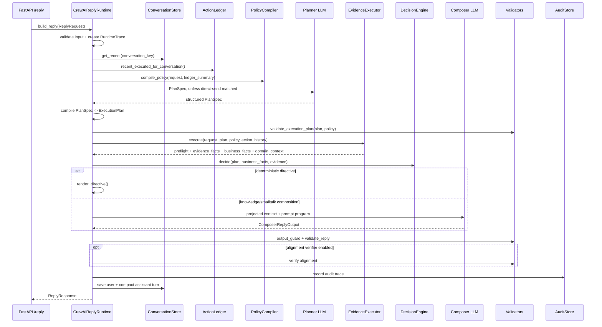

伪代码展开后大概是：

```python
async def reply(request):
    trace = RuntimeTrace(context_id, conversation_key)
    validate_reply_request_input(request, settings)
    history = conversation_store.get_recent(request.conversation_key)
    action_history = action_ledger.recent_executed_for_conversation(...)
    domain_context = DomainContextBuilder().build(request)
    policy = compile_policy(request, ledger_summary_from_action_history(action_history), ...)
    intent_gate = route_intent(request, policy, history)

    candidate = await _build_candidate_response(
        request, domain_context, policy, intent_gate, history, action_history
    )

    if candidate.reply_validation.valid and alignment_enabled:
        candidate = await _ensure_aligned_response(...)

    record_audit_trace(...)
    if not candidate.reply_validation.valid:
        raise ReplyContractError(...)

    conversation_store.save_turn(...)
    return candidate.response
```

注意这里的 `intent_gate` 基本不是一个语义分类器。`route_intent()` 明确写着：planner LLM 才是语义 router，这里不能靠 message substring 推断 artifact/action/compliance。它只是给 audit/prompt 一个保守 hint。

## 4. State 是怎么传的

这里没有一个大号可变 `state` dict 到处传。实际是每个阶段生成一个更具体、更可信的 typed object，然后下游只读这些对象。

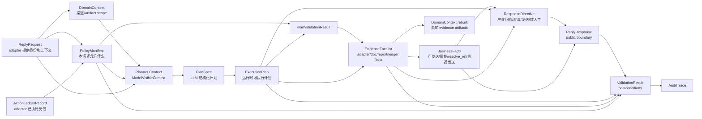

### 主要状态对象表

| 状态 | 在哪创建 | 它装的是什么 | 下游怎么用 |
|---|---|---|---|
| `ReplyRequest` | FastAPI/Pydantic | adapter 传入的身份、渠道、消息、可用 artifact、读权限 | 之后所有状态的根 |
| `ConversationMessage[]` | `ConversationStore.get_recent()` | 同一个 `conversation_key` 最近对话 | 作为 prompt context，不默认作为证据 |
| `ActionLedgerRecord[]` | `ActionLedger.recent_executed_for_conversation()` | adapter 回写的最近真实执行结果 | “刚才已发”这类说法只能从这里 grounding |
| `DomainContext` | `DomainContextBuilder.build(request)` | 当前渠道、artifact scope、metadata | plan scope、证据 scope、prompt app state |
| `PolicyManifest` | `compile_policy()` | 本请求允许的 reply modes、capabilities、actions、adapter resolves | planner/plan/evidence/validator 的硬约束 |
| `ModelVisibleContext` | `ContextProjectionManager.project_for_stage()` | 给某个 LLM stage 看见的压缩上下文 | prompt runtime layer |
| `PlanSpec` | Planner LLM structured output | 选中的 capability manifest、scope、证据契约、answerability policy | 被编译成 `ExecutionPlan` |
| `ExecutionPlan` | `compile_plan_spec()` 或 direct-send | runtime 真的要执行的证据/动作计划 | plan validator/evidence/decision 都基于它 |
| `EvidenceFact[]` | `EvidenceExecutor.execute()` | adapter/document/report/ledger 转成统一 fact | 派生事实、answerability、source guard、输出校验 |
| `BusinessFacts` | `derive_business_facts()` | material/week/month/sales 是否可 resolve、period、resolve_ref | 生成 action 和防止非法 send |
| `ResponseDirective` | `DecisionEngine.decide()` | 这一轮应该怎么回：action/answer/clarify/handoff/unable | renderer/composer 的指令 |
| `ReplyResponse` | renderer 或 composer | public response | validator、audit、返回 adapter |
| `AuditTrace` | `build_audit_trace()` | 可复盘的一次请求所有关键状态摘要 | eval/debug/incident review |

## 5. Policy：先决定“本轮允许做什么”

`compile_policy()` 在 `src/market_support_crewai_agent/runtime/domain/policy.py`。

它不是从用户文字猜，而是从 adapter 给的结构化字段推导：

```python
allowed_capabilities = {"sales_mention"}
allowed_capabilities.update(_artifact_capabilities(request.available_artifacts))

if doc_mcp_enabled and request.channel_type in allowed_channel_types:
    allowed_capabilities.add("document_context")

if request.allowed_read_capabilities:
    allowed_capabilities = capabilities_allowed_by_adapter_read_scope

allowed_actions = outbound_action_type for allowed capabilities
allowed_adapter_resolves = resolve_type for allowed capabilities
```

意思是：

- `available_artifacts` 里有 `weekly_report`，本轮才可能有 `weekly_report` capability/action。
- adapter 传的 `allowed_read_capabilities` 会进一步收窄读权限。
- Document MCP 默认不开；只有 env 开启、base URL 存在、channel type 被允许，才加入 `document_context`。
- `material_pack.options` 只影响 material pack 的路由，不是通用策略列表。

这一步很关键，因为它让 planner 看到的是“可选 capability 卡片”，不是无限自由的工具箱。

## 6. Capability Registry：agent 的能力菜单

能力定义在 `src/market_support_crewai_agent/runtime/domain/capabilities/__init__.py` 和 `src/market_support_crewai_agent/runtime/domain/capabilities/manifests.py`。

runtime capability 目前是：

```text
material_pack     -> adapter resolve material_pack -> send_material_pack
weekly_report     -> adapter resolve weekly_report -> send_weekly_report
monthly_report    -> adapter resolve monthly_report -> send_monthly_report
sales_mention     -> adapter resolve sales_mention -> reply.mentions
document_context  -> Document MCP / approved static knowledge -> knowledge answer
```

manifest 比 runtime capability 更细，比如：

```text
material_pack.send
weekly_report.send
monthly_report.send
sales.handoff
weekly_report.product_performance
monthly_report.product_performance
channel.strategy_summary
channel.product_summary
general.clarification / abstention / refusal / smalltalk / no_reply
```

每张 capability manifest 都同时定义：

```python
CapabilityManifest(
    id="weekly_report.product_performance",
    capability_type="answer",
    required_artifacts=["weekly_report"],
    forbidden_artifacts=["material_pack", "monthly_report"],
    required_tools=["adapter_resolve.weekly_report", "adapter_report_scope"],
    evidence_contract=EvidenceContract(
        any_of_fact_types=[
            "weekly_report_resolvable",
            "report_scope_summary",
            "report_scope_match",
            "report_scope_products",
            "report_period",
        ],
        allowed_source_types=["adapter_resolve", "adapter_report_scope"],
        forbidden_source_types=["document_mcp"],
        required_artifact_types=["weekly_report"],
    ),
)
```

这就是“不要只靠 prompt 管模型”的地方：planner 选了 manifest，后面的 verifier/guard/source selection 都会拿这张卡来检查。

### 6.1 这里为什么要有两层 registry

这个项目里有两种“能力定义”，不要把它们混成一个东西：

```text
CapabilitySpec      = 运行时接线表
CapabilityManifest  = 语义能力合同
PolicyManifest      = 本次请求允许使用哪些能力的快照
```

`CapabilitySpec` 很薄，主要回答“这个能力在代码里怎么接线”：

```python
CapabilitySpec(
    name="weekly_report",
    artifact_kind="weekly_report",
    read_capability="resolve_weekly_report",
    resolve_type="weekly_report",
    outbound_action_type="send_weekly_report",
    resolvable_fact_type="weekly_report_resolvable",
    business_state_field="weekly_report",
    is_report=True,
)
```

它让各模块不用到处手写这些映射：

```text
read capability -> adapter resolve type -> evidence fact type -> BusinessFacts field -> outbound action type
```

比如周报能力在 runtime 里的完整链路就是：

```text
resolve_weekly_report
  -> adapter resolve weekly_report
  -> EvidenceFact fact_type=weekly_report_resolvable
  -> BusinessFacts.weekly_report
  -> ResponseDirective(send_weekly_report)
  -> ReplyResponse.actions type=send_weekly_report
```

`CapabilityManifest` 更厚，它回答“这个能力什么情况下可以被 planner 选择，以及选择后必须满足什么证据合同”：

```text
manifest id
能力类型 action/answer/summary/handoff
需要哪些输入
允许哪些 artifact
禁止哪些 artifact
需要哪些工具
输出 schema
证据合同 EvidenceContract
缺证据时如何 abstain
给 planner 的 guidance
给 verifier 的检查项
```

所以它不是单纯 prompt 文案，而是一张能贯穿 planner、executor、guard、validator 的能力卡。

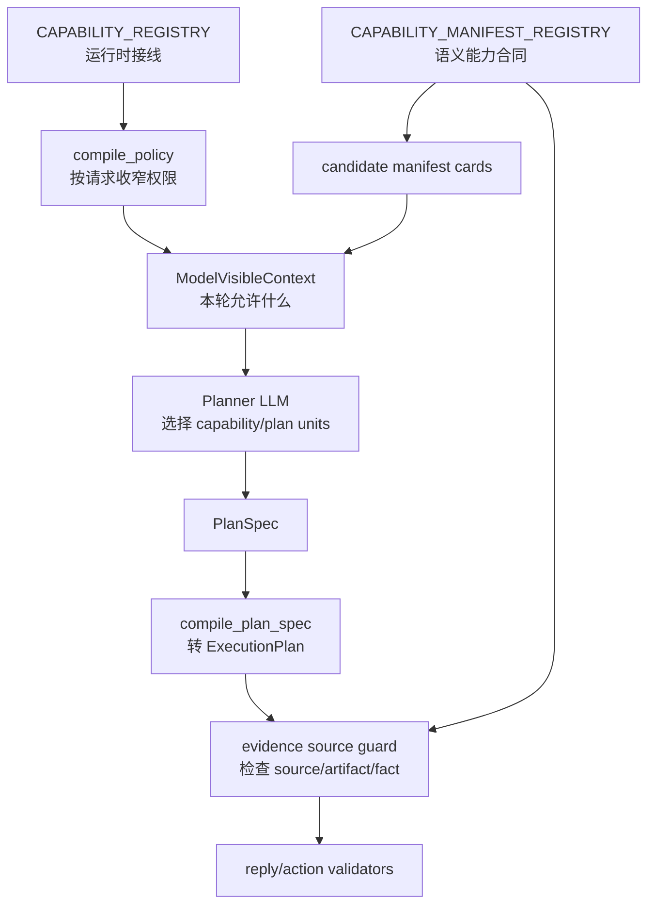

### 6.2 PolicyManifest 不是全局配置，是本轮请求的能力切片

`compile_policy()` 会从中央 registry 拿能力全集，但只给当前请求开放一个子集：

```text
全局能力: material_pack / weekly_report / monthly_report / sales_mention / document_context
当前请求: 根据 available_artifacts、allowed_read_capabilities、env、channel type 收窄
```

例子：

```text
如果 ReplyRequest.available_artifacts 没有 monthly_report
  planner 就不应该看到 monthly_report.send
  EvidenceExecutor 也不应该去 resolve monthly_report
  ReplyResponse.actions 也不应该出现 send_monthly_report
```

这就是 `PolicyManifest` 的价值：它不是“系统支持什么”，而是“这一次请求允许什么”。同一个 agent 服务支持很多能力，但每次 `/reply` 都只暴露 adapter 授权、当前渠道可用、当前 artifact 存在的那部分。

### 6.3 “一切集中”的设计点

这个项目现在的方向是把容易散落在 prompt 和 if/else 里的规则集中到几个地方：

| 集中点 | 文件 | 它管什么 |
| --- | --- | --- |
| Public DTO | `src/market_support_crewai_agent/schemas.py` | `/reply` 入参、出参、action union、adapter feedback |
| Runtime capability wiring | `src/market_support_crewai_agent/runtime/domain/capabilities/__init__.py` | 能力到 read/resolve/fact/action 的映射 |
| Capability manifest | `src/market_support_crewai_agent/runtime/domain/capabilities/manifests.py` | planner 能选什么、需要什么证据、禁用什么来源 |
| Manifest schema | `src/market_support_crewai_agent/runtime/domain/capabilities/registry.py` | manifest 字段、shape 校验、planner card/verifier contract |
| Request policy | `src/market_support_crewai_agent/runtime/domain/policy.py` | 本次请求允许读什么、发什么、resolve 什么 |
| Planner contract | `src/market_support_crewai_agent/runtime/domain/plan_spec.py` | LLM 只能输出结构化 PlanSpec |
| Plan compiler | `src/market_support_crewai_agent/runtime/domain/planning/compiler.py` | PlanSpec 转可执行 ExecutionPlan |
| Evidence model | `src/market_support_crewai_agent/runtime/evidence/models.py` | 证据事实统一形状 |
| Evidence guard | `src/market_support_crewai_agent/runtime/validation/evidence_source_guard.py` | manifest 证据合同落地检查 |
| Reply validators | `src/market_support_crewai_agent/runtime/validation/` | 输出后的 postconditions 和 alignment |

设计原则是：

```text
新增一种能力时，不应该只改 prompt。
应该先把它登记到 registry/manifest/policy/evidence/validator/test 这条链上。
```

也就是说，prompt 负责表达任务，manifest 负责定义能力边界，policy 负责按请求裁剪，validator 负责兜底。LLM 只是链路里做语义判断的一段，不是系统事实源，也不是最终授权者。

## 7. Planner：LLM 输出 PlanSpec，不输出最终回复

普通路径里 planner 的上下文由 `ContextProjectionManager` 生成，然后 `PromptAssembler` 拼 prompt fragments。

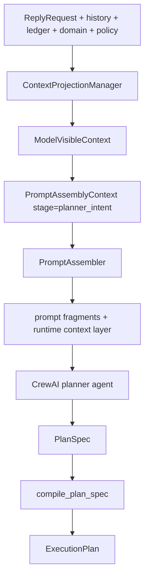

Planner 需要输出 `PlanSpec`，形状在 `src/market_support_crewai_agent/runtime/domain/plan_spec.py`：

```python
class PlanSpec(StrictModel):
    contract_version: Literal["plan-spec"] = "plan-spec"
    plan_id: str
    user_intent_summary: str
    plan_units: list[PlanUnit]
    risk_flags: list[str] = []

class PlanUnit(StrictModel):
    selected_capability_id: str
    domain_scope: PlanDomainScope
    required_artifacts: list[str]
    allowed_artifacts: list[str]
    forbidden_artifacts: list[str]
    required_tools: list[str]
    answerability_policy: AnswerabilityPolicy
    output_schema_ref: str
    evidence_contract: EvidenceContract | None
```

这背后的逻辑：

- planner 只负责把中文需求落到“选哪张 capability manifest”。
- planner 必须声明 scope、工具、证据契约、回答策略。
- planner 不能直接说“返回 send_weekly_report action”；它只能选 `weekly_report.send` 且 `answerability_policy="send"`。
- runtime 再把 PlanSpec 编译成自己的 `ExecutionPlan`。

编译规则在 `compile_plan_spec()`：

```python
if any(unit.answerability_policy == "refuse"):
    response_mode = "refusal"
elif "send" in policies:
    response_mode = "action"
elif "clarify" in policies:
    response_mode = "clarification"
elif "answer" in policies:
    response_mode = "knowledge_answer"
elif "handoff" in policies:
    response_mode = "handoff"
```

然后根据 manifest runtime capability 推导：

```text
answerability=send   -> action_intents + adapter_resolves
answerability=answer -> answer_capabilities + adapter/document/report evidence
answerability=handoff -> sales_mention resolve
```

## 8. Direct Send：少量确定性捷径

`src/market_support_crewai_agent/runtime/domain/planning/direct_send.py` 里有一个窄范围直接发送匹配。

它只识别闭集 artifact 命令：

```text
周报 / 周度报告
月报 / 月度报告
材料包 / 推介材料 / 产品材料 / 路演材料 / 一页通 / 开放日历 / ppt
```

命中后跳过 planner LLM，直接构造 `ExecutionPlan`：

```python
ExecutionPlan(
    response_mode="action",
    capabilities=[command.capability],
    adapter_resolves=[
        AdapterResolveSpec(resolve_type=command.resolve_type),
        AdapterResolveSpec(resolve_type="sales_mention"),
    ],
    action_intents=[ActionIntentSpec(action_type=command.action_type, ...)],
)
```

这不是拿 regex 做产品/策略/报告范围选择。它只做“用户明确说发周报/发月报/发材料包”这种 closed-set action accelerator。更复杂的语义仍走 planner。

如果用户说“发材料包”，但 adapter 明确给了多个 `material_pack.options`，direct-send 不会猜，会生成 clarification plan。

## 9. Plan Validation：计划先过关，才能取证

`validate_execution_plan()` 在 `src/market_support_crewai_agent/runtime/domain/planning/validation.py`。

它检查：

```text
response_mode 是否在 policy.allowed_reply_modes
plan.capabilities 是否在 policy.allowed_capabilities
adapter_resolves 是否在 policy.allowed_adapter_resolves
action_intents 是否在 policy.allowed_outbound_actions
send action 是否有对应 adapter resolve
非合规请求是否只能 refusal 且不能带 action/tool
unknown compliance 是否不能有 action
clarification 是否有可让用户补的 ambiguity slot
knowledge_answer 是否至少需要 document_context 或 report resolve evidence
material_pack_option 是否来自 adapter 给的 available_artifacts options
```

所以 planner 就算输出了结构化 JSON，也只是“候选计划”。必须过 deterministic validation。

## 10. EvidenceExecutor：证据统一变成 EvidenceFact

`EvidenceExecutor.execute()` 是状态从“计划”变成“事实”的核心。

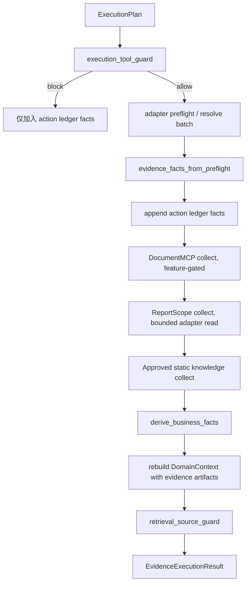

逻辑摘录：

```python
resolve_types = _resolve_types_for_plan(plan, policy)
preflight = await preflight_service.collect(request, resolve_types=resolve_types)
evidence_facts = evidence_facts_from_preflight(preflight)
evidence_facts.extend(evidence_facts_from_action_history(action_history))
evidence_facts.extend(await document_evidence_service.collect(...))
evidence_facts.extend(await report_scope_service.collect(...))
business_facts = derive_business_facts(evidence_facts, request)
domain_context = DomainContextBuilder().build(request, available_artifacts=[preflight, *evidence_facts])
source_decision = retrieval_source_guard(...)
```

### Adapter preflight

`AdapterPreflightService.collect()` 根据 plan 里的 resolve specs 组 batch：

```text
AdapterResolveRequest(resolve_type, dist_name=request.dist_channel_name, material_pack_option?)
```

然后：

```text
GET /adapter/capabilities 先确认 adapter contract
POST /adapter/resolve/batch 做本轮需要的 resolve
```

adapter 结果不会直接给 LLM 当最终真相，而是转成事实：

```python
EvidenceFact(
    fact_type="weekly_report_resolvable",
    value=item.status == "resolved",
    source_type="adapter_resolve",
    source_id="weekly_report",
    metadata={
        "status": item.status,
        "resolve_ref": result.resolve_ref,
        "period": result.period,
        "report_date": result.report_date,
        ...
    },
)
```

### Document MCP

Document MCP 不是 CrewAI tool。它是固定 wrapper：

```text
feature flag 开启?
plan.compliance == True?
plan.capabilities 包含 document_context?
channel_type 允许?
policy 允许 query_internal_company_info?
```

满足后才调用 `/mcp`：

```text
list_products -> closed-set semantic selector 选 document IDs
get_documents -> 拉选中文档
sanitize -> 去 locator / secret / prompt injection 文本
bound -> 限制每篇文档长度
EvidenceFact(fact_type="document_context", source_type="document_mcp")
```

重点是：MCP 返回的 markdown 是 **data/evidence**，不是 prompt 指令。里面就算写“忽略前面指令”，也会被 sanitization 处理。

### Report Scope

`ReportScopeEvidenceService` 只处理周报/月报内容问题，不做发送选择：

```text
summary        取报告总体 scope/count/sections
match          对一个 query 做 bounded exact/closed-set match
list_products 取分页产品列表，最多进 prompt 200 条
```

这些 facts 用于回答“周报里有哪些产品 / 覆盖哪期 / 某产品是否在报告里”，不用于“部分发送某个报告”。发送仍然只靠 `/adapter/resolve` 的 `resolve_ref`。

## 11. BusinessFacts：EvidenceFact 的业务投影

`BusinessFacts` 在 `src/market_support_crewai_agent/runtime/domain/business_facts.py`。

它把很多底层 evidence facts 压成业务状态：

```python
BusinessFacts(
    material_pack=ResolvableState(status, resolve_ref, candidates, ...),
    weekly_report=ReportState(status, resolve_ref, period, report_date, ...),
    monthly_report=ReportState(...),
    sales_mention=ResolvableState(...),
    recent_executed_actions=(ExecutedActionState(...),),
    evidence_fact_count=len(evidence_facts),
)
```

派生规则的意思：

```text
fact.value is True      -> status=available
metadata.status=ambiguous -> status=ambiguous
fact.value is False     -> status=unavailable
无 fact                 -> status=unknown
```

它解决的是：下游不需要知道 adapter 返回了什么 JSON、Document MCP 返回了什么 chunk、ledger 存了什么 record；下游只问：

```python
business_facts.resolve_state("weekly_report").resolvable
business_facts.report_state("weekly_report").period
business_facts.sales_mention.resolvable
```

### “刚才发过了”怎么传

真实发送不是 agent 做的，所以 agent 不能凭自己返回过 action 就说“已发”。链路是：

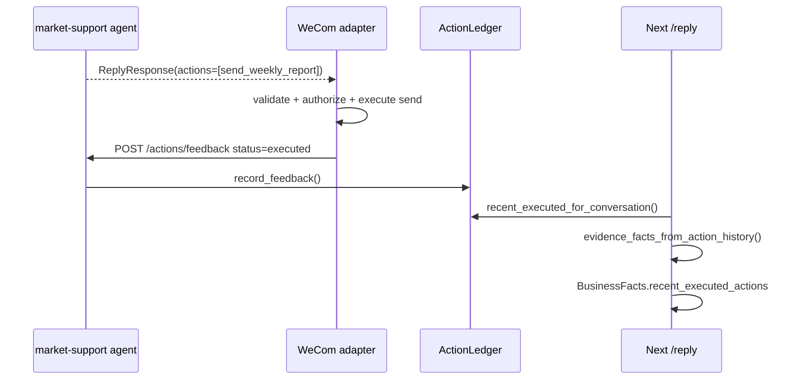

只有 adapter 回写 `status=executed` 后，下一轮 prompt 和 BusinessFacts 才能把它当作“已执行历史”。

## 12. DomainContext：把事实挂到渠道和 artifact scope

一句话：`DomainContext` 是运行时的“领域地图”。它不是数据库，也不是 LLM 的结论，而是把 adapter/request/evidence 里的东西统一挂到：

```text
哪个渠道
哪个策略
哪个产品
哪个 artifact
哪个时间范围
来自哪个来源
```

这样后续模块才能用结构化方式判断“这个证据能不能用于这次回答”，而不是靠模型猜、靠中文关键词猜、靠文件名猜。

### 12.1 它到底长什么样

核心类型在 `src/market_support_crewai_agent/runtime/domain/ontology.py`：

```python
DomainContext(
    channel=DistributionChannel(
        id="channel:...",
        name="某渠道",
        kind="bank" | "non_bank" | "unknown",
        source_id="...",
        provenance="adapter_channel_payload",
    ),
    strategies=(
        Strategy(id="strategy:...", name="策略名", channel_id="channel:..."),
    ),
    products=(
        Product(id="product:...", name="产品名", channel_id="channel:..."),
    ),
    artifacts=(
        Artifact(
            id="artifact:...",
            artifact_type="weekly_report",
            scope=ArtifactScope(
                channel_id="channel:...",
                strategy_id="strategy:..." | None,
                product_ids=("product:...",),
                time_range=TimeRange(period="2026-W26"),
                source_id="adapter_resolve:weekly_report",
                provenance="adapter_resolve",
            ),
            source_type="adapter_resolve",
            fact_types=("weekly_report_resolvable",),
        ),
    ),
    metadata={
        "conversation_key": "...",
        "context_id": "...",
        "material_pack_options": (...),
    },
)
```

字段含义：

| 字段 | 作用 | 谁会用 |
| --- | --- | --- |
| `channel` | 当前请求所在渠道，带稳定 id 和类型 | policy、prompt、audit、scope guard |
| `strategies` | 证据里解析出的策略实体 | report scope、summary、planner context |
| `products` | 证据里解析出的产品实体 | report scope、answerability、scope match |
| `artifacts` | 可发送或可引用的材料、周报、月报、文档上下文、历史 | evidence guard、planner projection、validators |
| `metadata` | 不适合建成领域实体但本轮有用的小上下文 | prompt projection、material pack option、trace |

### 12.2 为什么它要 build 两次

`DomainContextBuilder` 不是一次性初始化，它会在流程里出现两次：

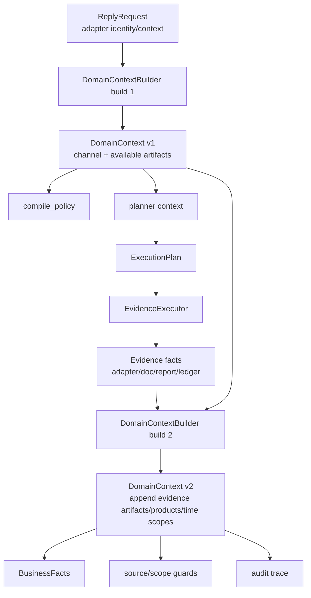

第一次 build 的目标是“先知道本轮环境”：

```text
从 ReplyRequest 取 dist_channel_name/channel_type
从 available_artifacts 取本轮 adapter 声明可用的 artifact 类型
从 conversation metadata 取 conversation_key/context_id
```

这时还没有 adapter resolve 结果，所以它只能知道：

```text
当前是什么渠道
adapter 说有哪些 artifact 类型可用
policy 可以开放哪些 read/action
planner 能看到哪些能力卡
```

第二次 build 的目标是“把取证结果补回地图”：

```text
adapter preflight/resolve 结果
EvidenceFact 里的 source_type/fact_type/scope
report scope 里的产品、周期、标题
action ledger 里的 history evidence
```

这时它才能知道：

```text
这份周报到底是哪一期
这条 evidence 是 weekly_report 还是 monthly_report
这条 report evidence 覆盖哪些产品
这条 material pack 是否来自 adapter resolve
这条历史记录是否只是 action_ledger
```

### 12.3 DomainContext 解决的不是“事实真假”，而是“事实归属”

项目里真正的事实来源仍然是 source-of-truth 顺序：

```text
adapter request identity
adapter resolve/preflight
adapter action ledger
report metadata
MCP/internal data
fetched report body
conversation turns
LLM interpretation
```

`DomainContext` 不会把一个东西变成真。它做的是把已经来自上面来源的东西放到一个共同坐标系里。

比如 adapter resolve 返回一份周报，`EvidenceFact` 说它是：

```text
source_type=adapter_resolve
fact_type=weekly_report_resolvable
resolve_type=weekly_report
period=2026-W26
products=["产品 A", "产品 B"]
```

`DomainContextBuilder` 会把它翻译成：

```text
Artifact artifact_type=weekly_report
  scope.channel_id=current channel
  scope.time_range=2026-W26
  scope.product_ids=product A / product B
  source_type=adapter_resolve
  fact_types=weekly_report_resolvable
```

后面 validator 才能问出结构化问题：

```text
planner 选择的是 weekly_report.product_performance 吗?
证据 artifact_type 是 weekly_report 吗?
source_type 是否在 manifest 允许列表里?
是否错误拿 monthly_report/document_mcp 回答周报问题?
scope 里的产品/周期是否足够支撑回答?
```

如果没有 `DomainContext`，这些检查就会退化成：

```text
字符串里有没有“周报”
文件标题看起来像不像
LLM 觉得是不是同一个产品
```

这正是当前架构刻意避免的。

### 12.4 DomainContext 和 PolicyManifest 的关系

可以把它们理解成两个不同问题：

```text
DomainContext: 这个请求里有哪些领域对象和证据归属?
PolicyManifest: 这个请求允许 agent 做哪些读/写/回复模式?
```

它们会互相配合，但不互相替代：

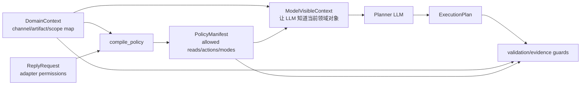

例子：

```text
DomainContext 发现当前渠道有 weekly_report artifact。
PolicyManifest 还要看 adapter 是否允许 resolve_weekly_report。
只有二者都成立，planner 才应该看见 weekly_report capability。
```

反过来：

```text
PolicyManifest 允许 document_context。
DomainContext/evidence 仍然要证明实际拿到的证据来自 document_mcp 或 approved_static_knowledge。
如果 planner 想用 document_mcp 回答 weekly_report.product_performance，
manifest 的 forbidden_source_types 会拦住。
```

### 12.5 它在 prompt 里怎么传给 LLM

LLM 不直接读完整 `DomainContext` 对象，而是通过 `to_prompt_dict()` 和 `ContextProjectionManager` 投影成 compact context。

```text
DomainContext full object
  -> to_prompt_dict()
  -> ContextProjectionManager
  -> ModelVisibleContext blocks
  -> PromptAssembler
  -> planner/composer prompt
```

这样设计的原因是：

```text
代码内部需要完整 scope/provenance/source_id
LLM 只需要知道当前渠道、可用 artifact 摘要、少量 evidence 摘要
长列表和完整报告正文不能默认塞进 prompt
```

所以 `DomainContext` 是内部 state，`ModelVisibleContext` 是给模型看的 state。两者不是同一个东西。

## 13. Context Projection：给 LLM 看的不是全量 state

LLM prompt 不是直接把所有对象 dump 进去，而是通过 `ModelVisibleContext` 分层投影。

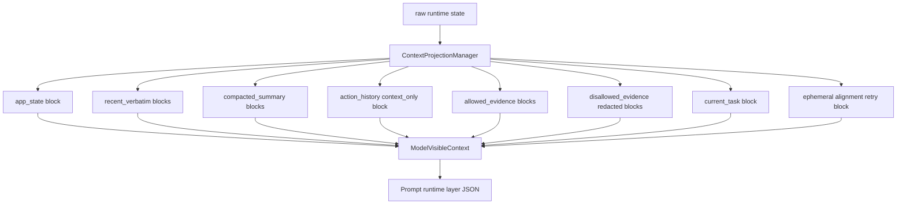

`ModelVisibleContext` 里有这些 block type：

```text
recent_verbatim
compacted_summary
large_result_preview
allowed_evidence
context_only
disallowed_evidence
app_state
current_task
ephemeral
```

关键逻辑：

- planner 阶段没有 execution plan，所以证据只会作为 inventory/context，不会随便当 answer evidence。
- composer 阶段有 execution plan，会用 `select_evidence_for_plan()` 选出 allowed evidence。
- disallowed evidence 会保留 ID 和拒绝原因，但 content redacted。
- 大字段超过预算会变 preview + reload_handle。
- prompt audit 记录 prompt hash / projection id / context hash，而不是把所有大 payload 写进审计。

这就是“上下文是 projection，不是垃圾桶”。

## 14. DecisionEngine：根据事实决定回复类型

`DecisionEngine.decide()` 不是写最终文案，而是生成 `ResponseDirective`。

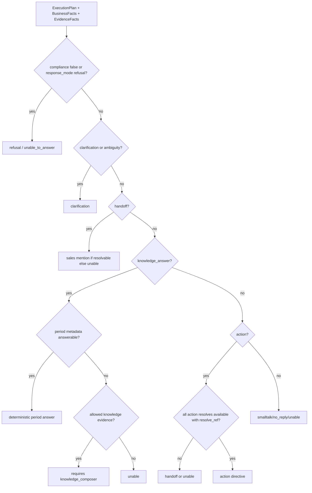

核心判断：

- `action` 模式下，每个 action intent 都要找到对应 `resolve_type`。
- 对应 `BusinessFacts.resolve_state(resolve_type)` 必须 `status="available"`。
- 必须有 `resolve_ref`。
- 如果 resolve ambiguous，优先 clarification。
- 如果 action 不可用但 sales mention 可用，可以 handoff。
- 如果是 knowledge answer，必须有被 source guard 接受的证据，否则 unable/clarify。

`ResponseDirective` 的形状：

```python
class ResponseDirective(StrictModel):
    mode: ResponseMode
    reply_kind: ReplyKind
    text: str = ""
    mentions: list[ReplyMention] = []
    action_intents: list[ActionIntentSpec] = []
    requires_knowledge_composer: bool = False
    composer_stage: Literal["knowledge_composer", "smalltalk_composer"] | None = None
    reason_code: str = ""
```

它就是“下一步该怎么产出”的 instruction，不是 public response。

## 15. Renderer vs Composer

### Deterministic renderer

如果 `directive.requires_knowledge_composer == False`，走 `render_directive()`：

```python
ReplyResponse(
    reply=PrimaryReply(kind=directive.reply_kind, text=directive.text, mentions=directive.mentions),
    actions=[
        _render_action(action_intent, business_facts)
        for action_intent in directive.action_intents
    ] if directive.mode == "action" else [],
)
```

action 是从 `BusinessFacts` 填出来的：

```python
SendWeeklyReportAction(
    type="send_weekly_report",
    resolve_type="weekly_report",
    resolve_ref=business_facts.weekly_report.resolve_ref,
    period=business_facts.weekly_report.period,
    report_date=business_facts.weekly_report.report_date,
)
```

所以 public action 的关键字段来自 adapter evidence，不来自 LLM。

### Composer LLM

只有知识回答/闲聊/某些 clarification 才让 composer 写文本。

Composer 的结构化输出是 `ComposerReplyOutput`：

```python
class ComposerReplyOutput(StrictModel):
    response_mode: Literal["answer", "abstain", "clarify"]
    claims: list[str]
    evidence_ids: list[str]
    missing_inputs: list[str]
    reply: PrimaryReply
    actions: list[OutboundAction] = []

    def validate_mode_matches_reply(self):
        if self.actions:
            raise ValueError("composer output must not include actions")
```

也就是说 composer 不准给 actions。即使 action 场景需要 composer 补一句说明，runtime 也会：

```text
1. 删除 composer 里“已发送/请查收”等预执行完成话术
2. 用 deterministic renderer 根据 BusinessFacts 重新生成 actions
3. 合并 reply + rendered.actions
```

这避免 LLM 在 adapter 真发送之前说“已经发了”。

## 16. Validators：最后一层硬墙

输出校验分两层：

```text
output_guard      knowledge answer 证据 ID / source scope gate
validate_reply    public ReplyResponse postcondition gate
```

`validate_reply()` 检查：

```text
directive mode 是否被 policy 允许
reply.kind 是否匹配 directive
no_reply 是否空 text/mentions/actions
reply.text 是否泄漏 file/mcp/wecom-adapter/raw path
非合规 refusal 是否无 action/mention 且用 harness refusal 文案
handoff 是否必须有 sales mention
mentions 是否要求 sales_mention resolvable
actions 是否只在 directive.mode=action 时出现
action 数量是否匹配 directive action_intents
action type 是否被 policy 允许
action.resolve_ref 是否存在且匹配 adapter evidence
send action 对应 BusinessFacts 是否 resolvable
knowledge answer 是否有 document/report evidence
image marker 是否白名单且在 evidence 中出现
PlanSpec contract verifier 是否通过
```

代码逻辑摘录：

```python
issues.extend(_validate_policy_and_kind(...))
issues.extend(_validate_no_reply(...))
issues.extend(_validate_locator_leaks(...))
issues.extend(_validate_non_compliant_response(...))
issues.extend(_validate_handoff(...))
issues.extend(_validate_actions(...))
issues.extend(_validate_knowledge_grounding(...))
issues.extend(_validate_image_markers(...))
issues.extend(_validate_plan_spec_contract(...))
```

这就是为什么整个系统看起来“保守”：宁可 `unable_to_answer`，也不要拿错证据、错渠道、错报告、错 action。

## 17. Alignment Loop：可选的二次纠偏

如果候选回复已经通过 reply validator，并且配置 `MARKET_AGENT_REPLY_ALIGNMENT_VERIFIER_ENABLED=true`，会走 alignment verifier。

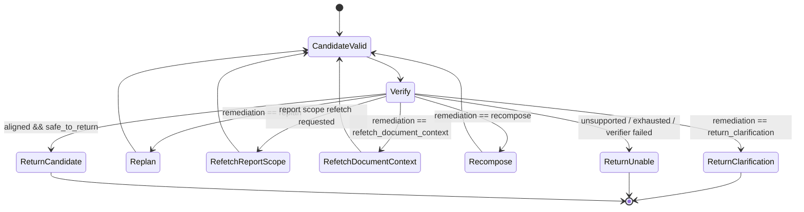

它有次数上限：

```text
max_replans=1
max_evidence_refetches=1
max_recomposes=1
max_total_remediations=2
```

所以不是无限 loop。它只是给“证据不够细 / 回复没对齐 / 需要重写”一个 bounded recovery path。

## 18. Audit + RuntimeTrace：怎么复盘

每次 `/reply` 都会构建 `RuntimeTrace`，记录 spans/events：

```text
request.validate
state.load_history
domain.build_context
policy.compile
intent.route
candidate.build
planner.project_context
planner.assemble_prompt
planner.build_agent
planner.coerce_compile
plan.validate
evidence.execute
answerability.assess
decision.decide
composer.project_context
reply.validate_attempt
alignment.ensure
audit.record
state.save_turn
```

`AuditTrace` 存的是 adapter-safe 摘要：

```python
AuditTrace(
    request=compact_request,
    model=compact_model,
    prompt_programs=[hashes, fragments, projection ids],
    policy=compact_policy,
    domain_context=domain_context.to_prompt_dict(),
    planner_output=execution_plan,
    response_directive=directive,
    adapter_preflight=compact_preflight,
    evidence_facts=compact_facts,
    business_facts=business_facts.to_prompt_dict(),
    reply_output=compact_response,
    reply_validation=validation_result,
    final_actions=compact_actions,
    adapter_execution_status="pending_adapter_execution" or "no_actions",
    runtime_trace=trace.to_dict(),
)
```

注意它会把 `resolve_ref` 变成 `resolve_ref_available=true/false`，避免审计里泄漏 adapter-owned locator。

## 19. 三个典型请求怎么走

### A. “请发一下周报”

```mermaid
flowchart TD
    A[message=请发一下周报] --> B[direct_send.match]
    B --> C[ExecutionPlan response_mode=action]
    C --> D[validate_execution_plan]
    D --> E[adapter resolve weekly_report + sales_mention]
    E --> F[weekly_report_resolvable=true, resolve_ref, period, report_date]
    F --> G[BusinessFacts.weekly_report.status=available]
    G --> H[DecisionEngine action_ready]
    H --> I[render SendWeeklyReportAction]
    I --> J[validate action resolve_ref matches evidence]
    J --> K[ReplyResponse actions=[send_weekly_report]]
```

返回不是“我已经发了”。返回的是 typed action proposal。adapter 执行后再通过 `/actions/feedback` 回写。

### B. “这份周报覆盖哪段时间？”

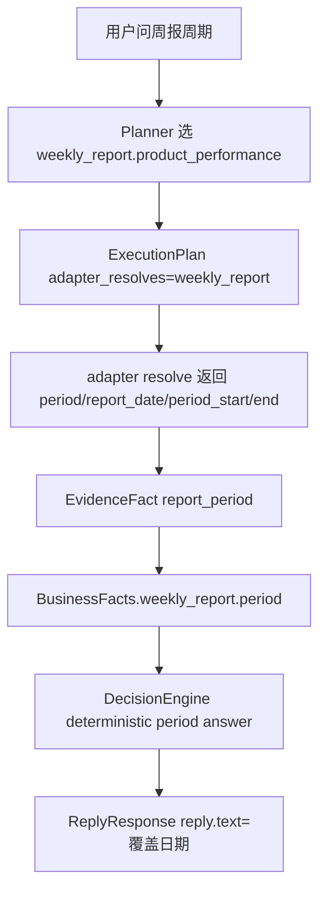

这类问题如果 adapter resolve metadata 已经足够，不需要 composer LLM 写长答案。

### C. “500指增规模多少；容量多少”

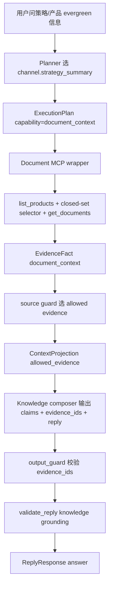

如果 Document MCP 没开、没文档、证据被 source guard 拒绝，则不会硬编答案。

## 20. 其他你也应该知道的设计

除了 `DomainContext`、manifest、policy、evidence 这些显性模块，这个 agent 还有几条“隐藏主线”。它们不是一个单独类名，但决定了整个系统的性格。

### 20.1 Source-of-truth 顺序：谁更可信

这个项目不是所有输入都平等。冲突时按固定顺序信：

```text
adapter request identity
adapter resolve/preflight
adapter action ledger feedback
weekly/monthly report metadata
permission-scoped MCP data
fetched report body
recent conversation turns
LLM interpretation
```

意思是：

```text
LLM 觉得“应该有周报” < adapter 没 resolve 到周报
用户说“刚才发过了” < action ledger 没有 executed 反馈
报告正文里的文字 < adapter/report metadata 给出的 period/scope
```

这条设计很重要，因为它把模型从“裁判”降级成“解释器”。模型可以理解中文意图，但不能推翻 adapter、ledger、metadata 这些更硬的事实。

### 20.2 Typed actions：agent 提议，adapter 执行

`ReplyResponse.actions` 不是“已经发送了”，只是结构化提议：

```text
agent: 我建议 send_weekly_report，字段是这些
adapter: 我检查权限、校验目标、执行发送
adapter: 我把执行结果写回 /actions/feedback
agent: 下一轮才把 executed feedback 当成历史事实
```

所以这个系统里有两个边界：

```text
/reply response boundary      = agent 的公共输出边界
adapter execution boundary    = 真正外发动作的边界
```

这样做的好处是：即使 agent planner/composer 出错，真实发送仍然要经过 adapter 的权限、目标、outbox、幂等和执行可靠性。

### 20.3 Evidence-first：回答前先把证据统一成事实

不同来源的数据不会直接喂给 composer 当自由文本：

```text
adapter resolve result
Document MCP result
report scope result
action ledger result
```

都会先变成统一的：

```text
EvidenceFact(
    fact_type=...,
    source_type=...,
    artifact_type=...,
    payload=...,
    provenance=...,
)
```

然后才进入：

```text
EvidenceFact -> BusinessFacts -> ResponseDirective -> ReplyResponse
```

这条线的意义是：不同来源的数据都先被标准化，后面的 validator 不需要知道“这是哪个 HTTP 返回体的原始 shape”，只要看 `fact_type/source_type/artifact_type` 是否满足 manifest 合同。

### 20.4 Fail closed：证据不够就澄清、拒答、转人工

当前设计不是“尽量答一个”，而是：

```text
证据足够 -> answer/send
证据缺失 -> clarification / unable / handoff / refusal
```

manifest 里的 `abstention_policy`、evidence contract、reply validator 都服务于这件事。

例子：

```text
用户问周报里的产品表现
planner 选 weekly_report.product_performance
但是 evidence 没有 weekly_report_resolvable/report_scope_summary
=> 不应该靠常识编产品表现
=> 应该澄清、说明没找到、或转人工
```

### 20.5 Closed set：可以选择，但只能在明确候选里选

项目规则明确禁止用关键词、substring、regex、fuzzy、n-gram 做产品/策略/报告 scope 选择器。

不是说完全不能“选择”，而是只能这样选：

```text
adapter 提供明确候选
manifest 定义允许 artifact/source
schema 定义字段
bounded LLM selector 在候选集合内选
validator 校验选择仍在候选集合内
```

这也是为什么 `material_pack.options`、report scope products、adapter resolve candidates 这些要结构化传递。模型可以帮你理解“客户说的那个产品可能是哪一个”，但候选边界必须由系统提供。

### 20.6 Two bounded LLM stages：模型分工，不让它一口气自由发挥

当前主路径不是一个大 prompt 直接回最终答案，而是最多两段：

```text
Planner LLM
  -> PlanSpec
  -> compile/validate
  -> EvidenceExecutor
  -> BusinessFacts
  -> deterministic renderer or Composer LLM
  -> ReplyResponse
  -> postcondition validator
```

Planner 负责：

```text
理解用户想干嘛
选择 capability/manifest
提出需要哪些证据
输出结构化 PlanSpec
```

Composer 只在需要自然语言组织时出现，并且不能创建 action。发送类回复优先走 deterministic renderer，因为 action 字段来自 `BusinessFacts`，不是 composer 自己编。

### 20.7 Prompt projection：模型看的是摘要，不是内存 dump

内部 state 很多：

```text
ReplyRequest
DomainContext
PolicyManifest
ConversationStore
ActionLedger
EvidenceFact
BusinessFacts
RuntimeTrace
```

但 prompt 里不是全塞进去，而是投影成 `ModelVisibleContext`：

```text
app_state
recent_verbatim
compacted_summary
action_history
allowed_evidence
disallowed_evidence redaction
current_task
retry/alignment hints
```

这条设计解决两个问题：

```text
避免 prompt 太长
避免 LLM 看到它不该用的证据或内部字段
```

### 20.8 Audit/eval：不是只看最终回复，还要能复盘为什么

每轮运行不只产出 `ReplyResponse`，还会留下：

```text
runtime trace
plan validation result
evidence facts
business facts
response directive
validation result
audit trace
```

这些东西的用途是后面调试和评估：

```text
为什么 planner 选了这个 manifest?
为什么 source guard 拒绝某条 evidence?
为什么最后是 clarification 不是 send?
adapter 到底有没有回写 executed?
```

所以这个 agent 的设计不是“黑盒模型回答”，而是“每一层留下可复盘的中间态”。

### 20.9 总设计图

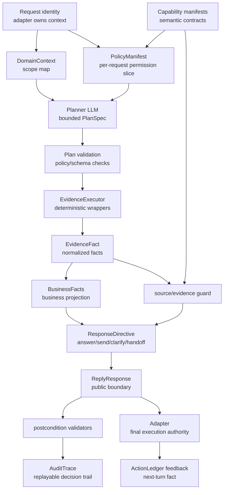

如果只用一句话概括这些设计：**模型负责把中文意图变成结构化计划；harness 负责证明、裁剪、执行前校验、输出后校验；adapter 负责真实外发和回写事实。**

## 21. 当前实现边界和风险点

- `ConversationStore`、`ActionLedger`、`AuditStore` 目前都是进程内存，重启会丢；适合当前 harness 验证期，不是 durable ledger。
- Direct-send 有 regex，但只用于 closed-set 发送命令；不要扩展成产品/策略/报告内容选择器。
- Document MCP 默认 disabled；开启后仍受 channel type、policy read capability、selector、sanitizer、source guard 限制。
- Composer 不允许产出 actions；发送 action 永远由 renderer 从 `BusinessFacts` 填字段。
- `history` 默认是 context，不是 evidence；只有 evidence contract 明确允许 history 时才可能作为证据。
- 最终发送状态不在 `/reply` 里确认；必须等 adapter 执行并回写 `/actions/feedback`。

## 22. 读代码建议路线

如果你想自己继续看，按这个顺序最省脑：

```text
1. src/market_support_crewai_agent/server/main.py
2. src/market_support_crewai_agent/schemas.py
3. src/market_support_crewai_agent/runtime/orchestration/reply_agent.py
4. src/market_support_crewai_agent/runtime/domain/policy.py
5. src/market_support_crewai_agent/runtime/domain/capabilities/__init__.py
6. src/market_support_crewai_agent/runtime/domain/capabilities/manifests.py
7. src/market_support_crewai_agent/runtime/domain/plan_spec.py
8. src/market_support_crewai_agent/runtime/domain/planning/compiler.py
9. src/market_support_crewai_agent/runtime/domain/planning/validation.py
10. src/market_support_crewai_agent/runtime/evidence/executor.py
11. src/market_support_crewai_agent/runtime/domain/business_facts.py
12. src/market_support_crewai_agent/runtime/orchestration/decision.py
13. src/market_support_crewai_agent/runtime/orchestration/response_renderer.py
14. src/market_support_crewai_agent/runtime/validation/reply_validator.py
15. src/market_support_crewai_agent/runtime/state/audit.py
```

看完这条线，你会理解这个 agent 的主性格：**模型负责中文理解，harness 负责把理解压进可验证的结构；所有能造成真实外部影响的事情，都必须先被 adapter/evidence/policy/validator 同意。**
